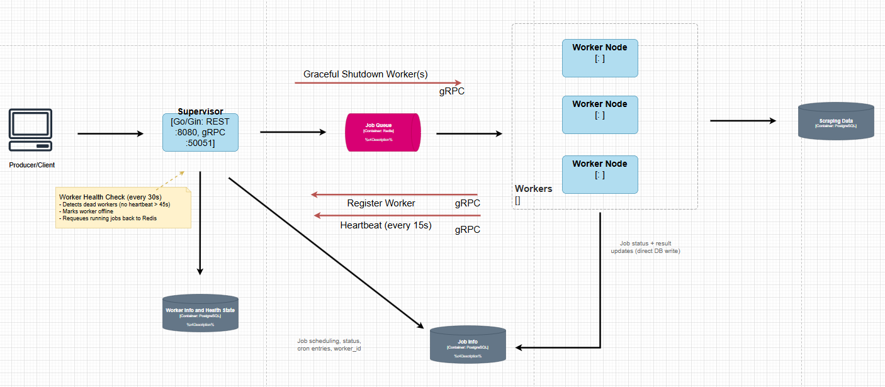

# Distributed Web Scraper

A distributed web scraping system built using **Supervisor/Worker** architecture. The Supervisor accepts scraping jobs via REST API, queues them in Redis, and dispatches them to one or more Worker nodes. Workers scrape the target sites using Colly and write results directly to PostgreSQL. Workers register themselves with the Supervisor via gRPC and send periodic heartbeats so the Supervisor can detect and recover from failures automatically.

## Job Distribution

- Supervisor pushes job payloads onto a Redis list (`LPush`).
- Each worker caps concurrent scrapes with a buffered channel used as a semaphore.
- Workers block on `BRPop` and whoever pops first claims the job, allowing Redis to handle routing with no central dispatcher needed.
- A `sync.WaitGroup` ensures in-flight jobs finish before shutdown.

## Technologies

| Layer | Tech |
|---|---|
| Language | Go |
| REST API | Gin |
| Inter-service communication | gRPC / Protocol Buffers |
| Job queue | Redis |
| Scraping | Colly |
| Database | PostgreSQL (x3) + GORM |
| Containerisation | Docker / Docker Compose |
